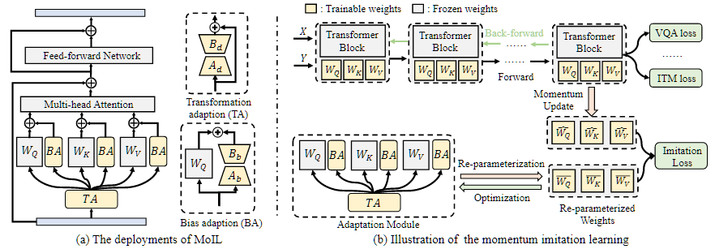

# MoIL

Official implementation of  "MoIL: Momentum Imitation Learning for Efficient Vision-Language Adaptation".
MoIL is a parameter-efficient transfer learning scheme for vision-language pre-training. MoIL directly optimizes the  approximation error  of low-rank adaptations  via  momentum imitation learning, and further reduces the learning difficulty via a new hybrid approximation function.

<p align="center">
	
</p>

## Updates 
- (2023/2/14) Release our project.

## Data Preparation
1. Prepare the datasets of downstream tasks, please refer to [ViLT](./DATA.md)

After that, the file structure should look like:
```
   |-- datasets
       |-- vqav2_val.arrow
       |-- vqav2_trainable_val.arrow
       |-- vqav2_train.arrow
       |-- vqav2_test.arrow
       ......
       
```
2. Download the pre-trained weights from [here](https://github.com/dandelin/ViLT/releases/download/200k/vilt_200k_mlm_itm.ckpt).

## Training
Fine-tune on VQAv2 with MoIL
```
python run.py with data_root=$DATA num_gpus=$GPUS num_nodes=$NODES task_finetune_vqa per_gpu_batchsize=16 load_path=$CKPT adapter=moil
``` 
Fine-tune on NLVR2 with MoIL
```
python run.py with data_root=$DATA num_gpus=$GPUS num_nodes=$NODES task_finetune_nlvr2 per_gpu_batchsize=32 load_path=$CKPT adapter=moil
``` 
Fine-tune on COCO IR/TR with MoIL
```
python run.py with data_root=$DATA num_gpus=$GPUS num_nodes=$NODES task_finetune_irtr_coco per_gpu_batchsize=4 load_path=$CKPT adapter=moil
``` 
Fine-tune on F30K IR/TR with MoIL
```
python run.py with data_root=$DATA num_gpus=$GPUS num_nodes=$NODES task_finetune_irtr_f30k_randaug per_gpu_batchsize=4  load_path=$CKPT adapter=moil
``` 
## Testing
Please refer to [EVAL.md](./EVAL.md) for more details.

